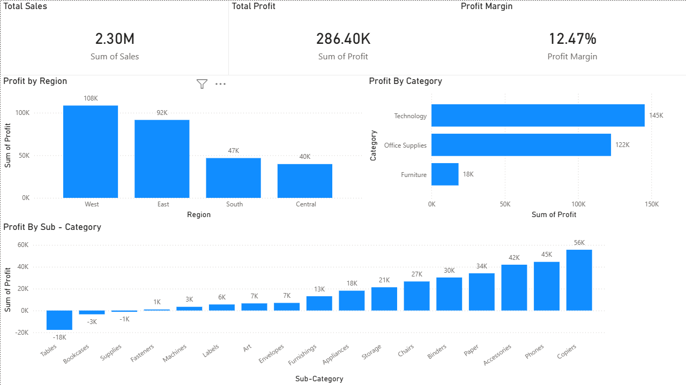
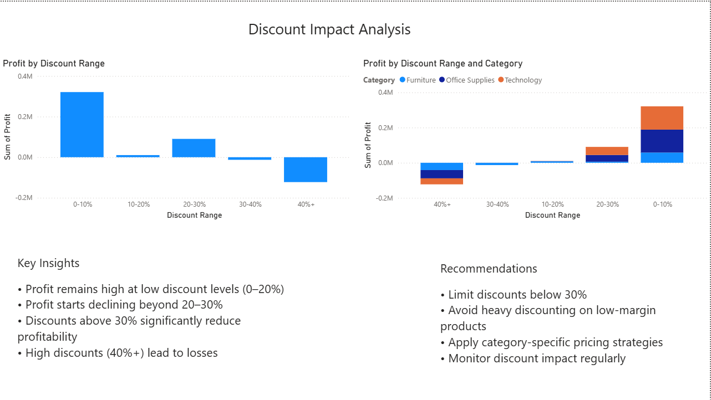

# 📊 Sales Performance Analysis (Superstore Dataset)

🚀 An end-to-end data analytics project focused on identifying the root cause of declining profitability despite strong sales and delivering actionable business insights.

---

## 🔍 Problem Statement
Despite strong revenue growth, the business is experiencing a decline in overall profit.

This project aims to:
- Identify the drivers of declining profitability  
- Analyze performance across regions, categories, and discount levels  
- Provide data-driven recommendations to improve business outcomes  

---

## 📁 Dataset Overview
- **Dataset:** Superstore Retail Data  
- **Key Features:**
  - Sales, Profit, Discount  
  - Category, Sub-Category  
  - Region, Customer Segment  

---

## 🎯 Objective
- Understand why profit is declining despite high sales  
- Identify underperforming regions and product categories  
- Analyze the impact of discounting on profitability  
- Recommend strategies to improve margins  

---

## 🛠️ Tools & Technologies
- **Excel** → Data Cleaning & Exploratory Data Analysis (EDA)  
- **SQL (MySQL)** → Data querying & deep analysis  
- **Power BI** → Interactive dashboard & visualization  

---

## 🔄 Analysis Workflow

### 1️⃣ Excel (EDA)
- Cleaned and structured the dataset  
- Created pivot tables for:
  - Region-wise performance  
  - Category & sub-category analysis  
  - Discount impact  
- Derived metric:  
  **Profit Margin = Profit / Sales**

---

### 2️⃣ SQL Analysis
Performed structured analysis using SQL:

- Region-wise sales and profit aggregation  
- Category-level profitability comparison  
- Identification of loss-making sub-categories  
- Discount segmentation using `CASE`:
  - 0–10%, 10–20%, 20–30%, 30–40%, 40%+  
- Analysis of **Discount vs Profit relationship**  
- Deep dive into **Tables (high-loss sub-category)**  

---

### 3️⃣ Power BI Dashboard

#### 📌 Page 1: Business Overview
- KPIs:
  - Total Sales  
  - Total Profit  
  - Profit Margin  
- Visuals:
  - Profit by Region  
  - Profit by Category  
  - Profit by Sub-category  

#### 📌 Page 2: Discount Analysis
- Profit by Discount Range  
- Profit by Discount Range & Category  

---

## 📊 Key Insights
- **West region** is the most profitable  
- **Central region** underperforms in profitability  
- **Furniture category** is consistently loss-making  
- **Tables** is the largest contributor to losses  
- Profit remains stable up to ~20% discount  
- Profit declines sharply beyond **30% discount**  
- Discounts above 30% lead to **negative profitability**  

---

## ⚠️ Root Cause
Excessive discounting on low-margin products (especially Tables) is the primary driver of declining profitability.

---

## 📊 Dashboard Preview

### 📌 Business Overview

### 📌 Discount Analysis

---

## 💡 Business Recommendations
- Limit discounts below **30% threshold**  
- Avoid aggressive discounting on low-margin products  
- Implement **category-specific pricing strategies**  
- Focus on high-margin product segments  
- Re-evaluate pricing strategy in the **Central region**  

---

## 📈 Business Impact (Potential)
- Improved profit margins through controlled discounting  
- Better pricing strategies across categories  
- Reduction in loss-making product sales  
- More sustainable revenue growth  

---

## 🚀 Key Learnings
- High sales ≠ high profit  
- Discount strategy directly impacts profitability  
- Importance of combining tools (Excel + SQL + BI)  
- Data storytelling is critical for business decisions  

---

## 🔮 Future Improvements
- Customer segmentation (RFM analysis)  
- Predictive modeling for profit optimization  
- Time-series trend analysis  
- Advanced Power BI (DAX measures & drilldowns)  

---

## 🙋‍♂️ About Me
Aspiring **Data Analyst / Decision Analyst** passionate about solving business problems using data.

**Skills:** SQL | Excel | Power BI | Data Analysis | Business Insights  

---

⭐ If you found this project useful, consider giving it a star!
